    winners1 <- goforit %>% filter(home_team==posteam&result>0)
    winners2 <- goforit %>% filter(away_team==posteam&result<0)
    winners <- rbind(winners1,winners2)
    losers1 <- goforit %>% filter(home_team==posteam&result<0)
    losers2 <- goforit %>% filter(away_team==posteam&result>0)
    losers <- rbind(losers1,losers2)

    conversion_rates <- c()
     for (yds in 1:10) {
          tbl <- winners %>% filter(ydstogo == yds)
          conversion_rates[yds] <- mean(tbl$fourth_down_converted, na.rm = TRUE)
     }
    conversion_rates1 <- c()
    for (yds in 1:10) {
          tbl <- losers %>% filter(ydstogo == yds)
          conversion_rates1[yds] <- mean(tbl$fourth_down_converted, na.rm = TRUE)
     }
    x <- 1:10
    plot(x,conversion_rates,type="b",pch=16,col="green",ylim=c(0.2,0.8),main="Conversion Rates for Plays between 41-50 yard line",xlab="Yards to go",ylab="Conversion Rate")
    points(x,conversion_rates1,type="b",pch=16,col="red")
    legend(6,0.8,legend=c("Teams that won","Teams that lost"),col=c("green","red"),lty=1:2)

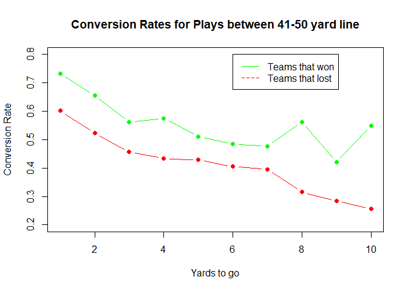

    field_position_groups <- list(
      "1-10" = goforit %>% filter(yardline_100 >= 1 & yardline_100 <= 10),
      "11-20" = goforit %>% filter(yardline_100 >= 11 & yardline_100 <= 20),
      "21-30" = goforit %>% filter(yardline_100 >= 21 & yardline_100 <= 30),
      "31-40" = goforit %>% filter(yardline_100 >= 31 & yardline_100 <= 40),
      "41-50" = goforit %>% filter(yardline_100 >= 41 & yardline_100 <= 50),
      "51-60" = goforit %>% filter(yardline_100 >= 51 & yardline_100 <= 60),
      "61-70" = goforit %>% filter(yardline_100 >= 61 & yardline_100 <= 70),
      "71-80" = goforit %>% filter(yardline_100 >= 71 & yardline_100 <= 80),
      "81-90" = goforit %>% filter(yardline_100 >= 81 & yardline_100 <= 90),
      "91-100" = goforit %>% filter(yardline_100 >= 91 & yardline_100 <= 100)
    )

    conversion_rates <- sapply(field_position_groups, function(group) {
      mean(group$fourth_down_converted, na.rm = TRUE)
    })

    positions <- names(conversion_rates)
    rates <- conversion_rates

    barplot(rates, names.arg = positions, main = "Fourth Down Conversion Rates by Field Position",
            xlab = "Field Position (yards from end zone)", ylab = "Conversion Rate", col = "green")

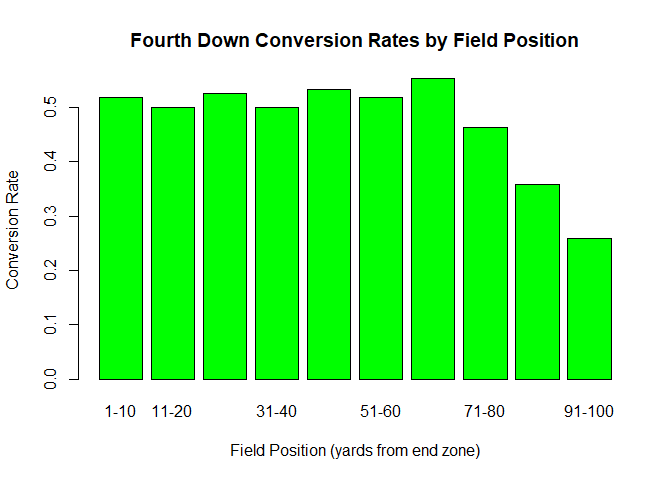

    for (position_group_name in names(field_position_groups)) {
      
      group_data <- field_position_groups[[position_group_name]]
      
      if (nrow(group_data) > 0) {
        
        conversion_rates <- numeric(10)
        
        for (yds in 1:10) {
          tbl <- group_data %>% filter(ydstogo == yds)
          conversion_rates[yds] <- mean(tbl$fourth_down_converted, na.rm = TRUE)
        }
        
        ydstogo <- 1:10
        correlation_value <- cor(ydstogo, conversion_rates, use = "complete.obs")
        
        print(paste("Correlation for field position group", position_group_name, ":", correlation_value))
        
        plot(1:10, conversion_rates, type = "b", pch = 16, col = "blue",
             main = paste("4th Down Conversion Rate for Field Position", position_group_name, "Yards from Endzone"),
             xlab = "Yards to Go", ylab = "Conversion Rate",
             ylim = c(0, 1), xlim = c(1, 10))
        
        Sys.sleep(2)
      } else {
        print(paste("No data available for field position group:", position_group_name))
      }
    }

    ## [1] "Correlation for field position group 1-10 : -0.869772451422295"

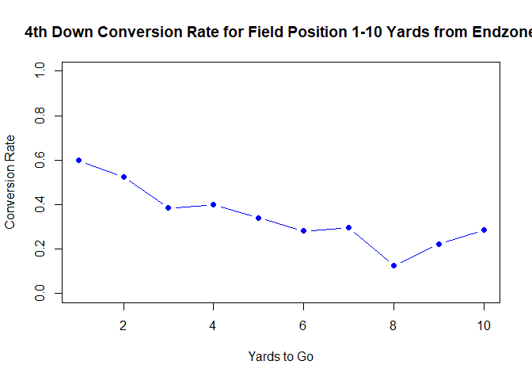

    ## [1] "Correlation for field position group 11-20 : -0.662610813861021"

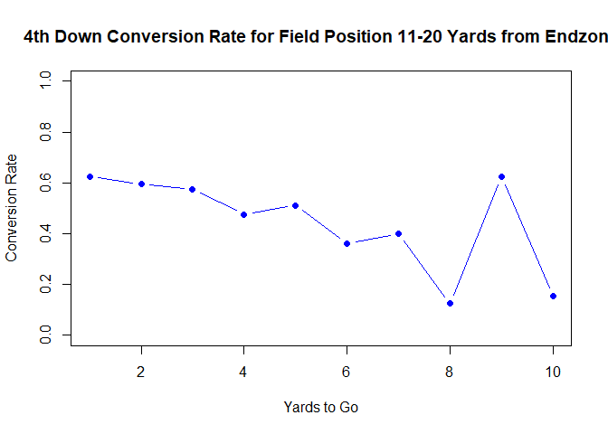

    ## [1] "Correlation for field position group 21-30 : -0.969618668547444"

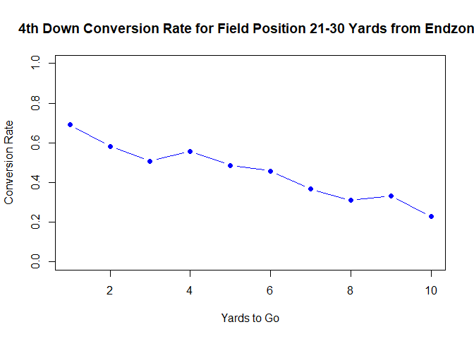

    ## [1] "Correlation for field position group 31-40 : -0.936602677045865"

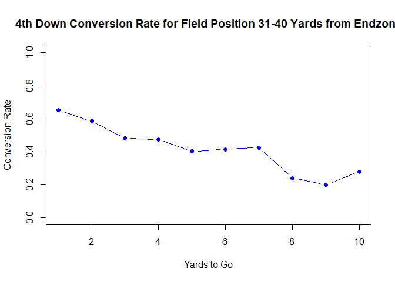

    ## [1] "Correlation for field position group 41-50 : -0.655778647864192"

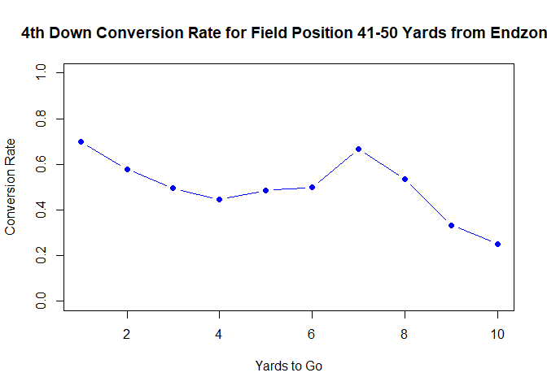

    ## [1] "Correlation for field position group 51-60 : -0.911838274203445"

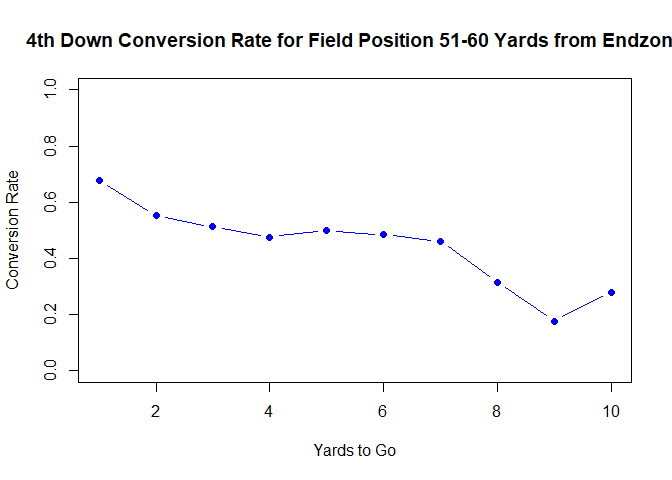

    ## [1] "Correlation for field position group 61-70 : -0.576899256520267"

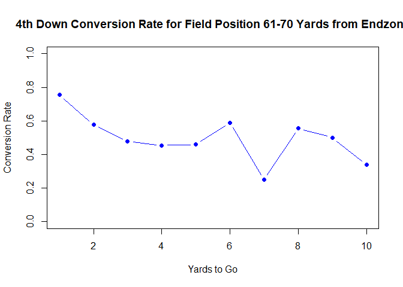

    ## [1] "Correlation for field position group 71-80 : -0.877720609634372"

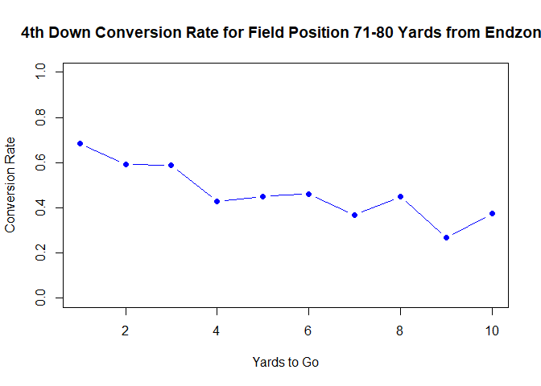

    ## [1] "Correlation for field position group 81-90 : -0.65960571649582"

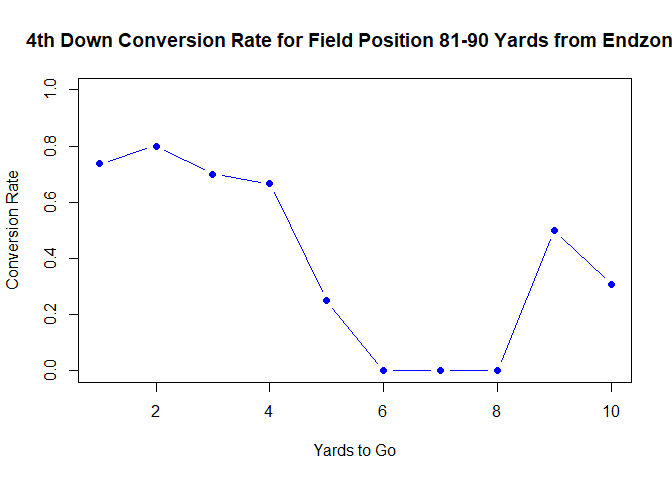

    ## [1] "Correlation for field position group 91-100 : 0.353553390593274"

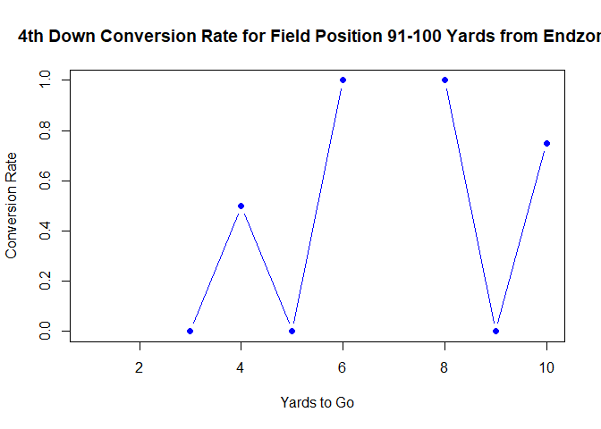

    group_data_11_20 <- field_position_groups[["11-20"]]

    data_4th_and_2 <- group_data_11_20 %>% filter(ydstogo == 2)

    num_data_points <- nrow(data_4th_and_2)

    print(paste("Number of data points for 4th down and 2 yards to go in the '11-20' field position group:", num_data_points))

    ## [1] "Number of data points for 4th down and 2 yards to go in the '11-20' field position group: 74"

    goforit$play_type %>% table()

    ## .
    ## pass  run 
    ## 4316 2464

    passes <- goforit %>% filter(play_type=="pass")
    plot(passes$comp_air_epa,passes$comp_yac_epa)

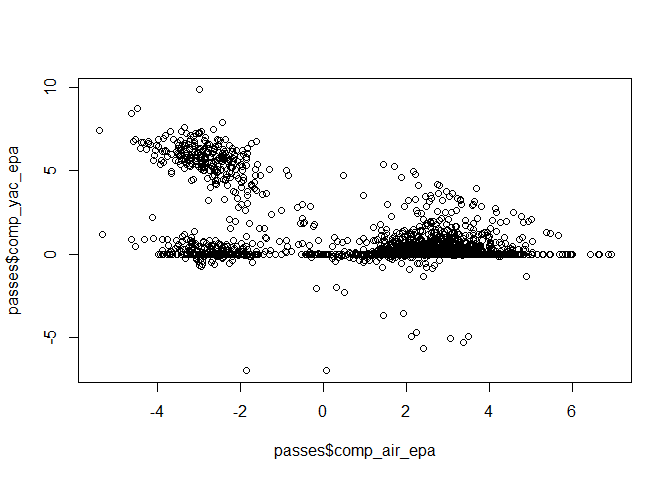

    goforit

    ## ── nflverse play by play data ──────────────────────────────────────────────────

    ## ℹ Data updated: 2024-08-19 09:50:07 EDT

    ## # A tibble: 6,780 × 372
    ##    play_id game_id     old_game_id home_team away_team season_type  week posteam
    ##      <dbl> <chr>       <chr>       <chr>     <chr>     <chr>       <int> <chr>  
    ##  1     576 2013_01_AT… 2013090808  NO        ATL       REG             1 NO     
    ##  2    3820 2013_01_AT… 2013090808  NO        ATL       REG             1 ATL    
    ##  3    4137 2013_01_BA… 2013090500  DEN       BAL       REG             1 BAL    
    ##  4    3549 2013_01_CI… 2013090802  CHI       CIN       REG             1 CHI    
    ##  5    4393 2013_01_GB… 2013090811  SF        GB        REG             1 SF     
    ##  6     986 2013_01_HO… 2013090901  LAC       HOU       REG             1 LAC    
    ##  7    1251 2013_01_HO… 2013090901  LAC       HOU       REG             1 HOU    
    ##  8    3353 2013_01_HO… 2013090901  LAC       HOU       REG             1 HOU    
    ##  9    4291 2013_01_KC… 2013090806  JAX       KC        REG             1 JAX    
    ## 10    3835 2013_01_MI… 2013090803  CLE       MIA       REG             1 CLE    
    ## # ℹ 6,770 more rows
    ## # ℹ 364 more variables: posteam_type <chr>, defteam <chr>, side_of_field <chr>,
    ## #   yardline_100 <dbl>, game_date <chr>, quarter_seconds_remaining <dbl>,
    ## #   half_seconds_remaining <dbl>, game_seconds_remaining <dbl>,
    ## #   game_half <chr>, quarter_end <dbl>, drive <dbl>, sp <dbl>, qtr <dbl>,
    ## #   down <dbl>, goal_to_go <int>, time <chr>, yrdln <chr>, ydstogo <dbl>,
    ## #   ydsnet <dbl>, desc <chr>, play_type <chr>, yards_gained <dbl>, …

    library(ggplot2)
    library(gridExtra)

    ## Warning: package 'gridExtra' was built under R version 4.4.2

    ## 
    ## Attaching package: 'gridExtra'

    ## The following object is masked from 'package:dplyr':
    ## 
    ##     combine

    shortplays <-  goforit %>% filter(ydstogo <= 2)
    par(mfrow=c(1,2))
    plot1 <- ggplot(goforit, aes(x = play_type)) +
      geom_bar() +
      labs(title = "Fourth-Down Attempts Across Seasons")
    plot2 <- ggplot(shortplays, aes(x = play_type)) +
      geom_bar() +
      labs(title = "Fourth and 1 and 2 ONLY")
    grid.arrange(plot1, plot2, ncol=2)

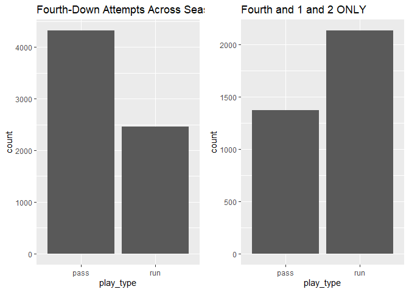

    ggplot(goforit, aes(x = down, y = air_epa, color = as.factor(success))) +
      geom_point(position="jitter") +
      labs(title = "EPA on Fourth-Down Plays")

    ## Warning: Removed 2775 rows containing missing values or values outside the scale range
    ## (`geom_point()`).

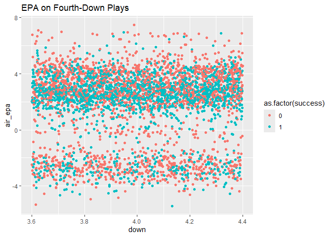

    for (i in 1:4){
    goforit_40 <- goforit %>% filter(yardline_100 <= 50 & yardline_100 >= 40, qtr==i)
    goforit_40_long <- goforit_40 %>% filter(ydstogo>=8)
    goforit_40_mid <- goforit_40 %>% filter(ydstogo>2&ydstogo<8)
    goforit_40_1 <- goforit_40 %>% filter(ydstogo<=2)
    dens <- density(goforit_40_long$score_differential_post)
    dens1 <- density(goforit_40_1$score_differential_post)
    dens2 <- density(goforit_40_mid$score_differential_post)
    plot(dens$x,dens$y,xlab="Posession Team Score - Defending Team Score",ylab="Density",ylim=c(0,0.065),col="red")
    points(dens1$x,dens1$y,col="green")
    points(dens2$x,dens2$y,col="yellow")
    }

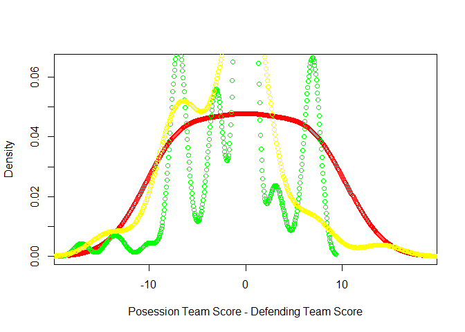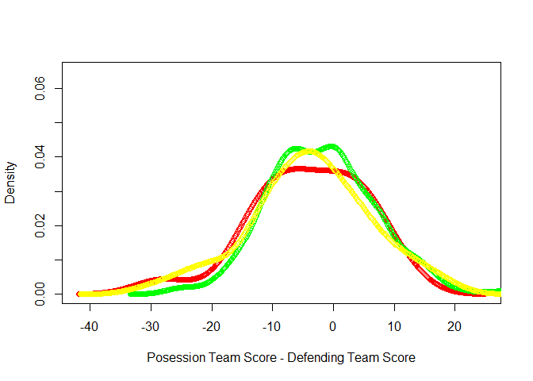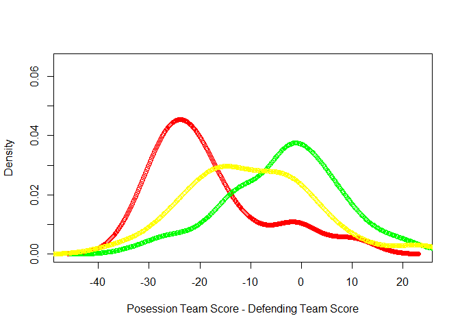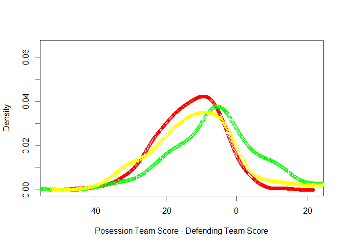

    ## Calculate expected value in each system and variance
    mean(goforit_40_long$success)

    ## [1] 0.257732

    mean(goforit_40_1$success)

    ## [1] 0.6056338

    counts <- c(nrow(goforit %>% filter(yardline_100 <= 50 & yardline_100 >= 40, qtr==1)),
    nrow(goforit %>% filter(yardline_100 <=50 & yardline_100 >= 40, qtr==2)),
    nrow(goforit %>% filter(yardline_100 <=50 & yardline_100 >= 40, qtr==3)),
    nrow(goforit %>% filter(yardline_100 <=50 & yardline_100 >= 40, qtr==4)))
    counts

    ## [1] 172 287 202 585

> We can see that teams that are going for it are in general losing,
> especially when they are going for it with a large yards to go. The
> opposite actually happens when there is only 1 or 2 yards to go as the
> winning team is more likely to go for it than the losing team. The
> success rate also drops off by a lot when you go up in yards to go,
> which is very much expected as going for it from 1-2 yards gives you
> about a 60% chance to convert, but when it’s 8+ yards it’s a slim 25%
> chance. The 4 plots are the density curves for all 4 quarters, but we
> have to watch since there is a lot larger sample size in qtr 4 than
> any other quarter.
