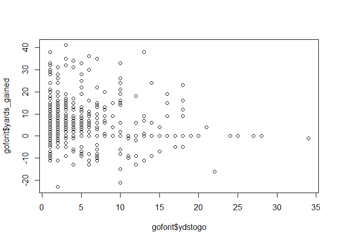
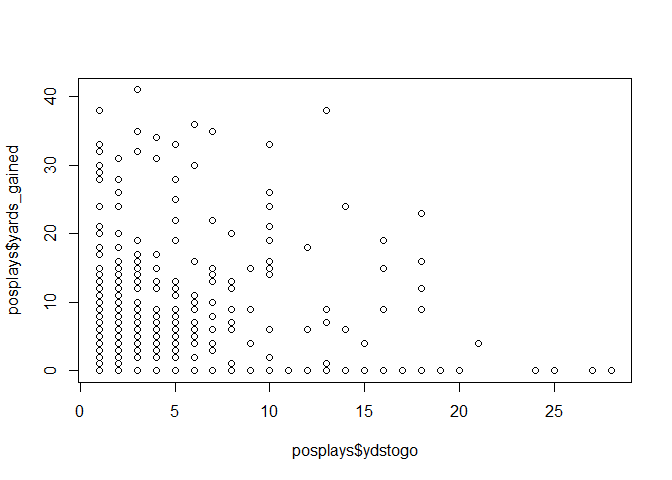
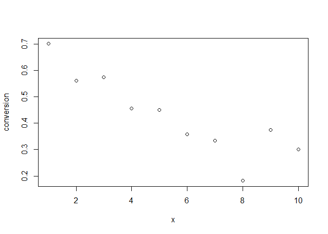

## R Markdown

    library(nflfastR)
    library(dplyr)
    library(readr)
    data1 <- read_csv("play_by_play_2023.csv")

    ## Warning: One or more parsing issues, call `problems()` on your data frame for details,
    ## e.g.:
    ##   dat <- vroom(...)
    ##   problems(dat)

    ## Rows: 49665 Columns: 372
    ## ── Column specification ────────────────────────────────────────────────────────
    ## Delimiter: ","
    ## chr  (114): game_id, home_team, away_team, season_type, posteam, posteam_typ...
    ## dbl  (206): play_id, old_game_id, week, yardline_100, quarter_seconds_remain...
    ## lgl   (45): lateral_receiver_player_id, lateral_receiver_player_name, latera...
    ## dttm   (3): time_of_day, end_clock_time, drive_real_start_time
    ## time   (4): time, drive_time_of_possession, drive_game_clock_start, drive_ga...
    ## 
    ## ℹ Use `spec()` to retrieve the full column specification for this data.
    ## ℹ Specify the column types or set `show_col_types = FALSE` to quiet this message.

    fours <- data1 %>% filter(down==4&(play_type=="punt"|play_type=="run"|play_type=="pass"))
    goforit <-  data1 %>% filter(down==4&(play_type=="run"|play_type=="pass"))
    posplays <- goforit %>% filter(yards_gained>=0)
    plot(goforit$ydstogo,goforit$yards_gained)

    cor(goforit$ydstogo,goforit$yards_gained)

    ## [1] -0.04427067

    plot(posplays$ydstogo,posplays$yards_gained)

    cor(posplays$ydstogo,posplays$yards_gained)

    ## [1] 0.01336762

    unique(data1$play_type)

    ##  [1] NA            "kickoff"     "run"         "pass"        "punt"       
    ##  [6] "no_play"     "extra_point" "field_goal"  "qb_kneel"    "qb_spike"

    goforit %>% filter(ydstogo>=1&ydstogo<=10)

    ## # A tibble: 763 × 372
    ##    play_id game_id     old_game_id home_team away_team season_type  week posteam
    ##      <dbl> <chr>             <dbl> <chr>     <chr>     <chr>       <dbl> <chr>  
    ##  1    4271 2023_01_AR…  2023091007 WAS       ARI       REG             1 ARI    
    ##  2    3413 2023_01_BU…  2023091100 NYJ       BUF       REG             1 NYJ    
    ##  3     403 2023_01_CA…  2023091000 ATL       CAR       REG             1 CAR    
    ##  4    3642 2023_01_CI…  2023091002 CLE       CIN       REG             1 CIN    
    ##  5    1142 2023_01_DA…  2023091013 NYG       DAL       REG             1 DAL    
    ##  6    1737 2023_01_DA…  2023091013 NYG       DAL       REG             1 NYG    
    ##  7    2515 2023_01_DA…  2023091013 NYG       DAL       REG             1 NYG    
    ##  8    2957 2023_01_DA…  2023091013 NYG       DAL       REG             1 NYG    
    ##  9    3047 2023_01_DA…  2023091013 NYG       DAL       REG             1 NYG    
    ## 10    3974 2023_01_DA…  2023091013 NYG       DAL       REG             1 DAL    
    ## # ℹ 753 more rows
    ## # ℹ 364 more variables: posteam_type <chr>, defteam <chr>, side_of_field <chr>,
    ## #   yardline_100 <dbl>, game_date <chr>, quarter_seconds_remaining <dbl>,
    ## #   half_seconds_remaining <dbl>, game_seconds_remaining <dbl>,
    ## #   game_half <chr>, quarter_end <dbl>, drive <dbl>, sp <dbl>, qtr <dbl>,
    ## #   down <dbl>, goal_to_go <dbl>, time <time>, yrdln <chr>, ydstogo <dbl>,
    ## #   ydsnet <dbl>, desc <chr>, play_type <chr>, yards_gained <dbl>, …

    conversion <- c()
    for (i in 1:10){
      tbl <- goforit %>% filter(ydstogo==i) 
      conversion[i] <- tbl$fourth_down_converted %>% mean()
    }
    x <- 1:10
    plot(x,conversion)

    cor(x,conversion)

    ## [1] -0.8838086

    goforit %>% filter(ydstogo==5)

    ## # A tibble: 60 × 372
    ##    play_id game_id     old_game_id home_team away_team season_type  week posteam
    ##      <dbl> <chr>             <dbl> <chr>     <chr>     <chr>       <dbl> <chr>  
    ##  1    1737 2023_01_DA…  2023091013 NYG       DAL       REG             1 NYG    
    ##  2    4051 2023_01_GB…  2023091008 CHI       GB        REG             1 CHI    
    ##  3    4441 2023_01_JA…  2023091003 IND       JAX       REG             1 IND    
    ##  4    4452 2023_01_SF…  2023091006 PIT       SF        REG             1 PIT    
    ##  5    1825 2023_02_KC…  2023091705 JAX       KC        REG             2 JAX    
    ##  6    2886 2023_03_CH…  2023092411 KC        CHI       REG             3 CHI    
    ##  7    4791 2023_03_LA…  2023092406 MIN       LAC       REG             3 MIN    
    ##  8    3129 2023_03_PI…  2023092412 LV        PIT       REG             3 LV     
    ##  9    2113 2023_03_TE…  2023092401 CLE       TEN       REG             3 TEN    
    ## 10    3331 2023_04_SE…  2023100200 NYG       SEA       REG             4 NYG    
    ## # ℹ 50 more rows
    ## # ℹ 364 more variables: posteam_type <chr>, defteam <chr>, side_of_field <chr>,
    ## #   yardline_100 <dbl>, game_date <chr>, quarter_seconds_remaining <dbl>,
    ## #   half_seconds_remaining <dbl>, game_seconds_remaining <dbl>,
    ## #   game_half <chr>, quarter_end <dbl>, drive <dbl>, sp <dbl>, qtr <dbl>,
    ## #   down <dbl>, goal_to_go <dbl>, time <time>, yrdln <chr>, ydstogo <dbl>,
    ## #   ydsnet <dbl>, desc <chr>, play_type <chr>, yards_gained <dbl>, …
