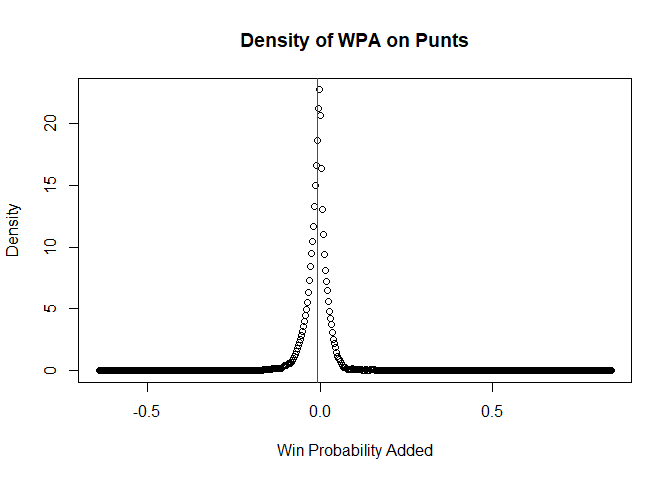

## R Markdown

    library(nflfastR)

    ## Warning: package 'nflfastR' was built under R version 4.4.2

    data <- load_pbp(1999:2024)
    dim(data)

    ## [1] 1230855     372

    head(data)

    ## ── nflverse play by play data ──────────────────────────────────────────────────

    ## ℹ Data updated: 2025-02-10 04:25:35 EST

    ## # A tibble: 6 × 372
    ##   play_id game_id      old_game_id home_team away_team season_type  week posteam
    ##     <dbl> <chr>        <chr>       <chr>     <chr>     <chr>       <int> <chr>  
    ## 1      35 1999_01_ARI… 1999091200  PHI       ARI       REG             1 PHI    
    ## 2      60 1999_01_ARI… 1999091200  PHI       ARI       REG             1 PHI    
    ## 3      82 1999_01_ARI… 1999091200  PHI       ARI       REG             1 PHI    
    ## 4     103 1999_01_ARI… 1999091200  PHI       ARI       REG             1 PHI    
    ## 5     126 1999_01_ARI… 1999091200  PHI       ARI       REG             1 PHI    
    ## 6     150 1999_01_ARI… 1999091200  PHI       ARI       REG             1 PHI    
    ## # ℹ 364 more variables: posteam_type <chr>, defteam <chr>, side_of_field <chr>,
    ## #   yardline_100 <dbl>, game_date <chr>, quarter_seconds_remaining <dbl>,
    ## #   half_seconds_remaining <dbl>, game_seconds_remaining <dbl>,
    ## #   game_half <chr>, quarter_end <dbl>, drive <dbl>, sp <dbl>, qtr <dbl>,
    ## #   down <dbl>, goal_to_go <dbl>, time <chr>, yrdln <chr>, ydstogo <dbl>,
    ## #   ydsnet <dbl>, desc <chr>, play_type <chr>, yards_gained <dbl>,
    ## #   shotgun <dbl>, no_huddle <dbl>, qb_dropback <dbl>, qb_kneel <dbl>, …

    allfours <- data %>% filter(down==4,yardline_100<=50,yardline_100>20)
    kicks <- allfours %>% filter(play_type=="field_goal")
    goforit <- allfours %>% filter(play_type!="field_goal") %>% filter(play_type!="punt") %>% filter(play_type!="no_play")
    dens <- density(kicks$wpa)
    plot(dens$x,dens$y,xlab="Win Probability Added",ylab="Density",main="Density of WPA on Attempted Field Goals")
    abline(v=mean(kicks$wpa),col="red",pch=8)

    punts <- allfours %>% filter(play_type=="punt")
    dens <- density(punts$wpa)
    plot(dens$x,dens$y,xlab="Win Probability Added",ylab="Density",main="Density of WPA on Punts")
    abline(v=mean(punts$wpa),col="red",pch=8)

    punt41 <- punts %>% filter(yardline_100==41)
    dens <- density(punt41$epa)
    plot(dens$x,dens$y,xlab="Expected Points Added",ylab="Density",main="Density of EPA on Punts")
    abline(v=mean(punt41$wpa),col="red",pch=8)

    msdpunt <- function(yard_line){
      new_df <- punts %>% filter(yardline_100==yard_line)
      c(mean(new_df$epa),sd(new_df$epa))
    }
    msdkick <- function(yard_line){
      new_df <- kicks %>% filter(yardline_100==yard_line)
      c(mean(new_df$epa),sd(new_df$epa))
    }
    msdgoforit1 <- function(yard_line){
      new_df <- goforit %>% filter(ydstogo==1) %>% filter(yardline_100==yard_line)
      c(mean(new_df$epa),sd(new_df$epa))
    }
    msdgoforit23 <- function(yard_line){
      new_df <- goforit %>% filter(ydstogo==2|ydstogo==3) %>% filter(yardline_100==yard_line)
      c(mean(new_df$epa),sd(new_df$epa))
    }
    msdgoforit47 <- function(yard_line){
      new_df <- goforit %>% filter(ydstogo>=4&ydstogo<=7) %>% filter(yardline_100==yard_line)
      c(mean(new_df$epa),sd(new_df$epa))
    }
    msdgoforit8 <- function(yard_line){
      new_df <- goforit %>% filter(ydstogo>=8) %>% filter(yardline_100==yard_line)
      c(mean(new_df$epa),sd(new_df$epa))
    }

    kick_epa_mean <- c()
    punt_wpa_mean <- sapply(41:50,msdpunt)[1,]
    kick_wpa_mean <- sapply(41:50,msdkick)[1,]
    punt_wpa_sd <- sapply(41:50,msdpunt)[2,]
    kick_wpa_sd <- sapply(41:50,msdkick)[2,]
    goforit_wpa_mean1 <- sapply(41:50,msdgoforit1)[1,]
    goforit_wpa_sd1 <- sapply(41:50,msdgoforit1)[2,]
    goforit_wpa_mean2 <- sapply(41:50,msdgoforit23)[1,]
    goforit_wpa_sd2 <- sapply(41:50,msdgoforit23)[2,]
    goforit_wpa_mean4 <- sapply(41:50,msdgoforit47)[1,]
    goforit_wpa_sd4 <- sapply(41:50,msdgoforit47)[2,]
    goforit_wpa_mean8 <- sapply(41:50,msdgoforit8)[1,]
    goforit_wpa_sd8 <- sapply(41:50,msdgoforit8)[2,]
    df <- data.frame(punt_wpa_mean,kick_wpa_mean,goforit_wpa_mean1,goforit_wpa_mean2,goforit_wpa_mean4,goforit_wpa_mean8,punt_wpa_sd,kick_wpa_sd,goforit_wpa_sd1,goforit_wpa_sd2,goforit_wpa_sd4,goforit_wpa_sd8)
    rownames(df) <- c("41","42","43","44","45","46","47","48","49","50")
    colnames(df) <- c("Punts","Field Goals","4th and 1","4th and 2&3","4th and 4-7","4th and 8+","SD of Punts","SD of Field Goals","SD of 4th and 1","SD of 4th and 2&3","SD of 4th and 4-7", "SD of 4th and 8+")
    df

    ##          Punts Field Goals 4th and 1 4th and 2&3 4th and 4-7 4th and 8+
    ## 41 -0.23985938  0.17408260 0.6986347  0.88200781   0.5966554 -0.1402938
    ## 42 -0.17653722  0.02122911 0.7523695  0.60866271   0.5307666 -0.2667566
    ## 43 -0.15336744  0.21244680 0.9541425  0.48286374   1.1232634  0.0819258
    ## 44 -0.22259947 -0.81760918 0.3357587  0.72196094   0.4399139 -0.6958463
    ## 45 -0.19524145 -0.66815714 0.9559150 -0.29518358   0.2161859 -0.3730436
    ## 46 -0.16086898 -0.19385913 0.8219887  0.03392665   0.3272982  0.6861949
    ## 47 -0.16783320 -1.00155353 0.4355331 -0.33888771  -0.1805661 -0.4410906
    ## 48 -0.04494476 -0.64015414 0.9661478  0.13615791   0.4910326 -0.2416206
    ## 49 -0.09438968 -0.70990129 0.7583656  0.47304753   0.4838890  0.3663387
    ## 50 -0.06990097         NaN 1.2038782  0.04992237   1.7085926 -0.1302199
    ##    SD of Punts SD of Field Goals SD of 4th and 1 SD of 4th and 2&3
    ## 41   0.6630008         2.2421531        2.420684          2.958540
    ## 42   0.7425340         2.4428542        2.422345          3.012592
    ## 43   0.6671156         2.1085196        2.529222          2.810956
    ## 44   0.6925030         1.1701920        2.663332          3.061863
    ## 45   0.6739660         1.5501478        2.358650          3.066321
    ## 46   0.7957766         2.0018721        2.203305          2.830107
    ## 47   0.7348118         0.3006872        2.657055          2.591020
    ## 48   0.7618265                NA        2.417465          2.628385
    ## 49   0.7107572                NA        2.684807          2.620868
    ## 50   0.8848009                NA        2.496866          3.139123
    ##    SD of 4th and 4-7 SD of 4th and 8+
    ## 41          3.076725         2.341651
    ## 42          2.958642         2.388182
    ## 43          3.134149         2.479336
    ## 44          3.075465         1.933862
    ## 45          2.726857         2.111081
    ## 46          2.862452         2.582864
    ## 47          2.811722         2.218970
    ## 48          2.618134         2.234696
    ## 49          2.801042         2.636598
    ## 50          2.717556         2.370746

In order to build functions individualized for each team that outlines
their decision in certain scenarios, the equation should look something
like this:

> mu + k(sigma)

where mu and sigma are mean and standard deviation respectively and the
k is an unknown coefficient.

Our goal is to find out the specific k coefficient for every combination
of on-field factors. The factors we should probably consider are: - Time
Remaining in Game - Teams Previous History - Current Point Differential

k will be a positive number but we should make the median of k = 1. -
half\_seconds\_remaining will vary inversely with k -
game\_seconds\_remaining will also vary inversely with k -
score\_differential will vary inversely with k

Also lets look into teams previous history

    individualteamprobs <- function(team){
      falcons <- allfours %>% filter(posteam==team)
      falcons$binydstogo <-  cut(falcons$ydstogo, breaks=c(0,1,3,7,50), labels=c("4th and 1","4th and 2-3","4th and 4-7","4th and 8+"))
      falconsgo <- falcons %>% filter(play_type!="field_goal") %>% filter(play_type!="punt") %>% filter(play_type!="no_play")
      falconskick <- falcons %>% filter(play_type=="field_goal")
      falconspunt <- falcons %>% filter(play_type=="punt")
      falconspunt$puntspot <- falconspunt$yardline_100 - falconspunt$kick_distance
      falconspunt$puntsuccess <- ifelse(falconspunt$puntspot <= 10, 1, 0)
      punttbl <- table(falconspunt$binydstogo,falconspunt$puntsuccess)
      kicktbl <- table(falconskick$binydstogo,falconskick$success)
      gotbl <- table(falconsgo$binydstogo,falconsgo$success)
      colnames(gotbl) <- c("Failed","Success")
      colnames(punttbl) <- c("Failed","Success")
      colnames(kicktbl) <- c("Failed","Success")
      govec <- c((gotbl[1,2]/sum(gotbl[1,])),(gotbl[2,2]/sum(gotbl[2,])),(gotbl[3,2]/sum(gotbl[3,])),(gotbl[4,2]/sum(gotbl[4,])))
      puntvec <- c((punttbl[1,2]/sum(punttbl[1,])),(punttbl[2,2]/sum(punttbl[2,])),(punttbl[3,2]/sum(punttbl[3,])),(punttbl[4,2]/sum(punttbl[4,])))
      kickvec <- c((kicktbl[1,2]/sum(kicktbl[1,])),(kicktbl[2,2]/sum(kicktbl[2,])),(kicktbl[3,2]/sum(kicktbl[3,])),(kicktbl[4,2]/sum(kicktbl[4,])))
      labs <- c("4th and 1","4th and 2-3","4th and 4-7","4th and 8+")
      probmatrix <- data.frame(labs,govec*100,kickvec*100,puntvec*100)
      colnames(probmatrix) <- c("Yards to go","Percent Chance of Conversion", "Percent Chance of Field Goal","Percent Chance of Punt inside 10 yard line")
      probmatrix
    }
    individualteamprobs("TEN")

    ##   Yards to go Percent Chance of Conversion Percent Chance of Field Goal
    ## 1   4th and 1                     60.65574                     61.53846
    ## 2 4th and 2-3                     57.89474                     68.75000
    ## 3 4th and 4-7                     30.64516                     74.07407
    ## 4  4th and 8+                     25.58140                     77.77778
    ##   Percent Chance of Punt inside 10 yard line
    ## 1                                   76.47059
    ## 2                                   55.35714
    ## 3                                   66.66667
    ## 4                                   60.08969

    falcons <- allfours %>% filter(posteam=="PHI")
      falcons$binydstogo <-  cut(falcons$ydstogo, breaks=c(0,1,3,7,50), labels=c("4th and 1","4th and 2-3","4th and 4-7","4th and 8+"))
      falconsgo <- falcons %>% filter(play_type!="field_goal") %>% filter(play_type!="punt") %>% filter(play_type!="no_play")
      falconskick <- falcons %>% filter(play_type=="field_goal")
      falconspunt <- falcons %>% filter(play_type=="punt")
      falconspunt$puntspot <- falconspunt$yardline_100 - falconspunt$kick_distance
      falconspunt$puntsuccess <- ifelse(falconspunt$puntspot <= 10, 1, 0)
      punttbl <- table(falconspunt$binydstogo,falconspunt$puntsuccess)
      kicktbl <- table(falconskick$binydstogo,falconskick$success)
      gotbl <- table(falconsgo$binydstogo,falconsgo$success)
      colnames(gotbl) <- c("Failed","Success")
      colnames(punttbl) <- c("Failed","Success")
      colnames(kicktbl) <- c("Failed","Success")
      govec <- c((gotbl[1,2]/sum(gotbl[1,])),(gotbl[2,2]/sum(gotbl[2,])),(gotbl[3,2]/sum(gotbl[3,])),(gotbl[4,2]/sum(gotbl[4,])))
      puntvec <- c((punttbl[1,2]/sum(punttbl[1,])),(punttbl[2,2]/sum(punttbl[2,])),(punttbl[3,2]/sum(punttbl[3,])),(punttbl[4,2]/sum(punttbl[4,])))
      kickvec <- c((kicktbl[1,2]/sum(kicktbl[1,])),(kicktbl[2,2]/sum(kicktbl[2,])),(kicktbl[3,2]/sum(kicktbl[3,])),(kicktbl[4,2]/sum(kicktbl[4,])))
      labs <- c("4th and 1","4th and 2-3","4th and 4-7","4th and 8+")
      probmatrix <- data.frame(labs,govec*100,kickvec*100,puntvec*100)
      colnames(probmatrix) <- c("Yards to go","Percent Chance of Conversion", "Percent Chance of Field Goal","Percent Chance of Punt inside 10 yard line")
    falcons

    ## ── nflverse play by play data ──────────────────────────────────────────────────

    ## ℹ Data updated: 2025-02-10 04:25:35 EST

    ## # A tibble: 1,101 × 373
    ##    play_id game_id     old_game_id home_team away_team season_type  week posteam
    ##      <dbl> <chr>       <chr>       <chr>     <chr>     <chr>       <int> <chr>  
    ##  1    3042 1999_01_AR… 1999091200  PHI       ARI       REG             1 PHI    
    ##  2    3824 1999_01_AR… 1999091200  PHI       ARI       REG             1 PHI    
    ##  3    3998 1999_01_AR… 1999091200  PHI       ARI       REG             1 PHI    
    ##  4     544 1999_02_TB… 1999091908  PHI       TB        REG             2 PHI    
    ##  5    3190 1999_02_TB… 1999091908  PHI       TB        REG             2 PHI    
    ##  6    2254 1999_03_PH… 1999092606  BUF       PHI       REG             3 PHI    
    ##  7    3870 1999_03_PH… 1999092606  BUF       PHI       REG             3 PHI    
    ##  8    2640 1999_04_PH… 1999100305  NYG       PHI       REG             4 PHI    
    ##  9    3139 1999_05_DA… 1999101003  PHI       DAL       REG             5 PHI    
    ## 10    2501 1999_06_PH… 1999101705  CHI       PHI       REG             6 PHI    
    ## # ℹ 1,091 more rows
    ## # ℹ 365 more variables: posteam_type <chr>, defteam <chr>, side_of_field <chr>,
    ## #   yardline_100 <dbl>, game_date <chr>, quarter_seconds_remaining <dbl>,
    ## #   half_seconds_remaining <dbl>, game_seconds_remaining <dbl>,
    ## #   game_half <chr>, quarter_end <dbl>, drive <dbl>, sp <dbl>, qtr <dbl>,
    ## #   down <dbl>, goal_to_go <dbl>, time <chr>, yrdln <chr>, ydstogo <dbl>,
    ## #   ydsnet <dbl>, desc <chr>, play_type <chr>, yards_gained <dbl>, …

## Creation of Team’s History Variables

We want to divide up team’s history in order to incorporate as many
variables as possible to achieve a better k. - Aggressiveness
(Attempts) - Success Rates

## ACF Plot of Conversion Rates

Here we are looking to see if the conversion success rates for
individual teams are correlated with lags from previous years. We go
back to 1999 in this data set.

    new_vec <- c()
    falcons <- allfours %>% filter(posteam=="MIN")
    for (i in 1999:2024){
      filtereddata1 <- falcons %>% filter(play_type=="run"|play_type=="pass") %>% filter(game_date>=i&game_date<i+1)
      new_vec[i-1998] <- filtereddata1$success %>% mean()
      new_vec <- na.omit(new_vec)
    }
    new_df <- data.frame(new_vec,lagged=lag(new_vec))
    acf(ts(new_vec),max.lag=20)

    ## Warning in plot.window(...): "max.lag" is not a graphical parameter

    ## Warning in plot.xy(xy, type, ...): "max.lag" is not a graphical parameter

    ## Warning in axis(side = side, at = at, labels = labels, ...): "max.lag" is not a
    ## graphical parameter
    ## Warning in axis(side = side, at = at, labels = labels, ...): "max.lag" is not a
    ## graphical parameter

    ## Warning in box(...): "max.lag" is not a graphical parameter

    ## Warning in title(...): "max.lag" is not a graphical parameter

After looking at a lot of different teams, there have been no real
significant autocorrelations in the lag plot for the mean conversion
rates over the past year.
