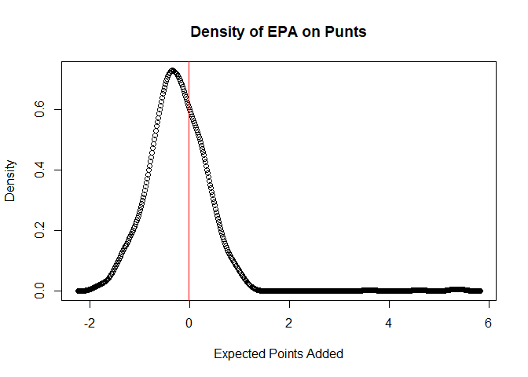

## R Markdown

    library(nflfastR)

    ## Warning: package 'nflfastR' was built under R version 4.4.2

    data <- load_pbp(2024)
    dim(data)

    ## [1] 49316   372

    head(data)

    ## ── nflverse play by play data ──────────────────────────────────────────────────

    ## ℹ Data updated: 2025-01-27 04:23:45 EST

    ## # A tibble: 6 × 372
    ##   play_id game_id      old_game_id home_team away_team season_type  week posteam
    ##     <dbl> <chr>        <chr>       <chr>     <chr>     <chr>       <int> <chr>  
    ## 1       1 2024_01_ARI… 2024090801  BUF       ARI       REG             1 <NA>   
    ## 2      40 2024_01_ARI… 2024090801  BUF       ARI       REG             1 ARI    
    ## 3      61 2024_01_ARI… 2024090801  BUF       ARI       REG             1 ARI    
    ## 4      83 2024_01_ARI… 2024090801  BUF       ARI       REG             1 ARI    
    ## 5     108 2024_01_ARI… 2024090801  BUF       ARI       REG             1 ARI    
    ## 6     133 2024_01_ARI… 2024090801  BUF       ARI       REG             1 ARI    
    ## # ℹ 364 more variables: posteam_type <chr>, defteam <chr>, side_of_field <chr>,
    ## #   yardline_100 <dbl>, game_date <chr>, quarter_seconds_remaining <dbl>,
    ## #   half_seconds_remaining <dbl>, game_seconds_remaining <dbl>,
    ## #   game_half <chr>, quarter_end <dbl>, drive <dbl>, sp <dbl>, qtr <dbl>,
    ## #   down <dbl>, goal_to_go <int>, time <chr>, yrdln <chr>, ydstogo <dbl>,
    ## #   ydsnet <dbl>, desc <chr>, play_type <chr>, yards_gained <dbl>,
    ## #   shotgun <dbl>, no_huddle <dbl>, qb_dropback <dbl>, qb_kneel <dbl>, …

    allfours <- data %>% filter(down==4,yardline_100<=50,yardline_100>20)
    kicks <- allfours %>% filter(play_type=="field_goal")
    goforit <- allfours %>% filter(play_type!="field_goal") %>% filter(play_type!="punt") %>% filter(play_type!="no_play")
    dens <- density(kicks$wpa)
    plot(dens$x,dens$y,xlab="Win Probability Added",ylab="Density",main="Density of WPA on Attempted Field Goals")
    abline(v=mean(kicks$wpa),col="red",pch=8)

    punts <- allfours %>% filter(play_type=="punt")
    dens <- density(punts$wpa)
    plot(dens$x,dens$y,xlab="Win Probability Added",ylab="Density",main="Density of WPA on Punts")
    abline(v=mean(punts$wpa),col="red",pch=8)

    punt41 <- punts %>% filter(yardline_100==41)
    dens <- density(punt41$wpa)
    plot(dens$x,dens$y,xlab="Expected Points Added",ylab="Density",main="Density of EPA on Punts")
    abline(v=mean(punt41$wpa),col="red",pch=8)

    msdpunt <- function(yard_line){
      new_df <- punts %>% filter(yardline_100==yard_line)
      c(mean(new_df$wpa),sd(new_df$wpa))*100
    }
    msdkick <- function(yard_line){
      new_df <- kicks %>% filter(yardline_100==yard_line)
      c(mean(new_df$wpa),sd(new_df$wpa))*100
    }
    msdgoforit1 <- function(yard_line){
      new_df <- goforit %>% filter(ydstogo==1) %>% filter(yardline_100==yard_line)
      c(mean(new_df$wpa),sd(new_df$wpa))*100
    }
    msdgoforit23 <- function(yard_line){
      new_df <- goforit %>% filter(ydstogo==2|ydstogo==3) %>% filter(yardline_100==yard_line)
      c(mean(new_df$wpa),sd(new_df$wpa))*100
    }
    msdgoforit47 <- function(yard_line){
      new_df <- goforit %>% filter(ydstogo>=4&ydstogo<=7) %>% filter(yardline_100==yard_line)
      c(mean(new_df$wpa),sd(new_df$wpa))*100
    }
    msdgoforit8 <- function(yard_line){
      new_df <- goforit %>% filter(ydstogo>=8) %>% filter(yardline_100==yard_line)
      c(mean(new_df$wpa),sd(new_df$wpa))*100
    }
    fourthand1 <- c()
    nums <- 41:50
    nums

    ##  [1] 41 42 43 44 45 46 47 48 49 50

    for (i in nums){
      fourthand1[i] <- msdgoforit1(i)[1]
      fourthand1
    }
    fourthand1[nums]

    ##  [1]  0.2582830  3.3971613 14.1367882  4.4050670  0.7903616  4.1418087
    ##  [7] -6.7984641  6.6379199  4.0787035  6.8245651

    kick_epa_mean <- c()
    punt_wpa_mean <- sapply(41:50,msdpunt)[1,]
    kick_wpa_mean <- sapply(41:50,msdkick)[1,]
    punt_wpa_sd <- sapply(41:50,msdpunt)[2,]
    kick_wpa_sd <- sapply(41:50,msdkick)[2,]
    goforit_wpa_mean1 <- sapply(41:50,msdgoforit1)[1,]
    goforit_wpa_sd1 <- sapply(41:50,msdgoforit1)[2,]
    goforit_wpa_mean2 <- sapply(41:50,msdgoforit23)[1,]
    goforit_wpa_sd2 <- sapply(41:50,msdgoforit23)[2,]
    goforit_wpa_mean4 <- sapply(41:50,msdgoforit47)[1,]
    goforit_wpa_sd4 <- sapply(41:50,msdgoforit47)[2,]
    goforit_wpa_mean8 <- sapply(41:50,msdgoforit8)[1,]
    goforit_wpa_sd8 <- sapply(41:50,msdgoforit8)[2,]
    df <- data.frame(punt_wpa_mean,kick_wpa_mean,goforit_wpa_mean1,goforit_wpa_mean2,goforit_wpa_mean4,goforit_wpa_mean8,punt_wpa_sd,kick_wpa_sd,goforit_wpa_sd1,goforit_wpa_sd2,goforit_wpa_sd4,goforit_wpa_sd8)
    rownames(df) <- c("41","42","43","44","45","46","47","48","49","50")
    colnames(df) <- c("Punts","Field Goals","4th and 1","4th and 2&3","4th and 4-7","4th and 8+","SD of Punts","SD of Field Goals","SD of 4th and 1","SD of 4th and 2&3","SD of 4th and 4-7", "SD of 4th and 8+")
    df

    ##         Punts Field Goals  4th and 1 4th and 2&3 4th and 4-7 4th and 8+
    ## 41 -0.9998212    6.192856  0.2582830  3.26366774         NaN  4.4350676
    ## 42 -0.7756468   -9.303720  3.3971613  7.38828952   2.3547859  4.3213414
    ## 43 -0.8332629   14.289020 14.1367882  1.81157552   2.2338535 -1.1266882
    ## 44 -2.1209253  -10.925937  4.4050670  4.75813299   9.3154785  1.2839394
    ## 45 -1.9153882    2.339849  0.7903616  3.66409933   0.4660798        NaN
    ## 46  0.2870717    6.008968  4.1418087  4.89111512   8.8765524 -0.0184642
    ## 47 -1.4784980    1.687822 -6.7984641 -0.03572845  -5.8720842  2.5560230
    ## 48 -0.7162455         NaN  6.6379199 -8.88941884  -3.1526898        NaN
    ## 49 -0.6852396         NaN  4.0787035  2.81131621   2.5320067        NaN
    ## 50 -0.5010317         NaN  6.8245651 -1.07315019  20.1202810 -1.2814142
    ##    SD of Punts SD of Field Goals SD of 4th and 1 SD of 4th and 2&3
    ## 41    3.109674          3.364126        8.486135          9.523778
    ## 42    4.092130         17.613861        7.059397          6.645343
    ## 43    2.637579         20.192356              NA         11.296974
    ## 44    4.268482                NA        6.066242          7.359467
    ## 45    2.689130                NA        6.932332          8.192734
    ## 46    4.940102                NA        7.388401          6.786703
    ## 47    3.405146                NA              NA                NA
    ## 48    1.969944                NA        6.325943          2.715214
    ## 49    3.689588                NA       13.923890                NA
    ## 50    2.704340                NA        4.572483          5.551556
    ##    SD of 4th and 4-7 SD of 4th and 8+
    ## 41                NA         6.324702
    ## 42          5.147846        10.723830
    ## 43          9.262532         1.612641
    ## 44         13.142429         4.544197
    ## 45          4.260577               NA
    ## 46          2.186972               NA
    ## 47                NA               NA
    ## 48          2.725956               NA
    ## 49          7.411038               NA
    ## 50                NA        22.647914

In order to build functions individualized for each team that outlines
their decision in certain scenarios, the equation should look something
like this:

> mu + k(sigma)

where mu and sigma are mean and standard deviation respectively and the
k is an unknown coefficient.

Our goal is to find out the specific k coefficient for every combination
of on-field factors. The factors we should probably consider are: - Time
Remaining in Game - Teams Previous History - Current Point Differential

k will be a positive number but we should make the median of k = 1. -
half\_seconds\_remaining will vary inversely with k -
game\_seconds\_remaining will also vary inversely with k -
score\_differential will vary inversely with k

Also lets look into teams previous history

    individualteamprobs <- function(team){
      falcons <- allfours %>% filter(posteam==team)
      falcons$binydstogo <-  cut(falcons$ydstogo, breaks=c(0,1,3,7,50), labels=c("4th and 1","4th and 2-3","4th and 4-7","4th and 8+"))
      falconsgo <- falcons %>% filter(play_type!="field_goal") %>% filter(play_type!="punt") %>% filter(play_type!="no_play")
      falconskick <- falcons %>% filter(play_type=="field_goal")
      falconspunt <- falcons %>% filter(play_type=="punt")
      falconspunt$puntspot <- falconspunt$yardline_100 - falconspunt$kick_distance
      falconspunt$puntsuccess <- ifelse(falconspunt$puntspot <= 10, 1, 0)
      punttbl <- table(falconspunt$binydstogo,falconspunt$puntsuccess)
      kicktbl <- table(falconskick$binydstogo,falconskick$success)
      gotbl <- table(falconsgo$binydstogo,falconsgo$success)
      colnames(gotbl) <- c("Failed","Success")
      colnames(punttbl) <- c("Failed","Success")
      colnames(kicktbl) <- c("Failed","Success")
      govec <- c((gotbl[1,2]/sum(gotbl[1,])),(gotbl[2,2]/sum(gotbl[2,])),(gotbl[3,2]/sum(gotbl[3,])),(gotbl[4,2]/sum(gotbl[4,])))
      puntvec <- c((punttbl[1,2]/sum(punttbl[1,])),(punttbl[2,2]/sum(punttbl[2,])),(punttbl[3,2]/sum(punttbl[3,])),(punttbl[4,2]/sum(punttbl[4,])))
      kickvec <- c((kicktbl[1,2]/sum(kicktbl[1,])),(kicktbl[2,2]/sum(kicktbl[2,])),(kicktbl[3,2]/sum(kicktbl[3,])),(kicktbl[4,2]/sum(kicktbl[4,])))
      labs <- c("4th and 1","4th and 2-3","4th and 4-7","4th and 8+")
      probmatrix <- data.frame(labs,govec*100,kickvec*100,puntvec*100)
      colnames(probmatrix) <- c("Yards to go","Percent Chance of Conversion", "Percent Chance of Field Goal","Percent Chance of Punt inside 10 yard line")
      probmatrix
    }
    individualteamprobs("PIT")

    ##   Yards to go Percent Chance of Conversion Percent Chance of Field Goal
    ## 1   4th and 1                          100                    100.00000
    ## 2 4th and 2-3                            0                    100.00000
    ## 3 4th and 4-7                            0                     66.66667
    ## 4  4th and 8+                            0                     90.00000
    ##   Percent Chance of Punt inside 10 yard line
    ## 1                                        NaN
    ## 2                                        100
    ## 3                                         50
    ## 4                                         40

    falcons <- allfours %>% filter(posteam=="DET")
      falcons$binydstogo <-  cut(falcons$ydstogo, breaks=c(0,1,3,7,50), labels=c("4th and 1","4th and 2-3","4th and 4-7","4th and 8+"))
      falconsgo <- falcons %>% filter(play_type!="field_goal") %>% filter(play_type!="punt") %>% filter(play_type!="no_play")
      falconskick <- falcons %>% filter(play_type=="field_goal")
      falconspunt <- falcons %>% filter(play_type=="punt")
      falconspunt$puntspot <- falconspunt$yardline_100 - falconspunt$kick_distance
      falconspunt$puntsuccess <- ifelse(falconspunt$puntspot <= 10, 1, 0)
      punttbl <- table(falconspunt$binydstogo,falconspunt$puntsuccess)
      kicktbl <- table(falconskick$binydstogo,falconskick$success)
      gotbl <- table(falconsgo$binydstogo,falconsgo$success)
      colnames(gotbl) <- c("Failed","Success")
      colnames(punttbl) <- c("Failed","Success")
      colnames(kicktbl) <- c("Failed","Success")
      govec <- c((gotbl[1,2]/sum(gotbl[1,])),(gotbl[2,2]/sum(gotbl[2,])),(gotbl[3,2]/sum(gotbl[3,])),(gotbl[4,2]/sum(gotbl[4,])))
      puntvec <- c((punttbl[1,2]/sum(punttbl[1,])),(punttbl[2,2]/sum(punttbl[2,])),(punttbl[3,2]/sum(punttbl[3,])),(punttbl[4,2]/sum(punttbl[4,])))
      kickvec <- c((kicktbl[1,2]/sum(kicktbl[1,])),(kicktbl[2,2]/sum(kicktbl[2,])),(kicktbl[3,2]/sum(kicktbl[3,])),(kicktbl[4,2]/sum(kicktbl[4,])))
      labs <- c("4th and 1","4th and 2-3","4th and 4-7","4th and 8+")
      probmatrix <- data.frame(labs,govec*100,kickvec*100,puntvec*100)
      colnames(probmatrix) <- c("Yards to go","Percent Chance of Conversion", "Percent Chance of Field Goal","Percent Chance of Punt inside 10 yard line")
    falcons

    ## ── nflverse play by play data ──────────────────────────────────────────────────

    ## ℹ Data updated: 2025-01-27 04:23:45 EST

    ## # A tibble: 37 × 373
    ##    play_id game_id     old_game_id home_team away_team season_type  week posteam
    ##      <dbl> <chr>       <chr>       <chr>     <chr>     <chr>       <int> <chr>  
    ##  1     866 2024_01_LA… 2024090812  DET       LA        REG             1 DET    
    ##  2    1683 2024_02_TB… 2024091503  DET       TB        REG             2 DET    
    ##  3    3194 2024_02_TB… 2024091503  DET       TB        REG             2 DET    
    ##  4    3867 2024_02_TB… 2024091503  DET       TB        REG             2 DET    
    ##  5    4256 2024_02_TB… 2024091503  DET       TB        REG             2 DET    
    ##  6    2757 2024_03_DE… 2024092209  ARI       DET       REG             3 DET    
    ##  7    3110 2024_03_DE… 2024092209  ARI       DET       REG             3 DET    
    ##  8    3393 2024_03_DE… 2024092209  ARI       DET       REG             3 DET    
    ##  9    1071 2024_06_DE… 2024101310  DAL       DET       REG             6 DET    
    ## 10    1598 2024_06_DE… 2024101310  DAL       DET       REG             6 DET    
    ## # ℹ 27 more rows
    ## # ℹ 365 more variables: posteam_type <chr>, defteam <chr>, side_of_field <chr>,
    ## #   yardline_100 <dbl>, game_date <chr>, quarter_seconds_remaining <dbl>,
    ## #   half_seconds_remaining <dbl>, game_seconds_remaining <dbl>,
    ## #   game_half <chr>, quarter_end <dbl>, drive <dbl>, sp <dbl>, qtr <dbl>,
    ## #   down <dbl>, goal_to_go <int>, time <chr>, yrdln <chr>, ydstogo <dbl>,
    ## #   ydsnet <dbl>, desc <chr>, play_type <chr>, yards_gained <dbl>, …
